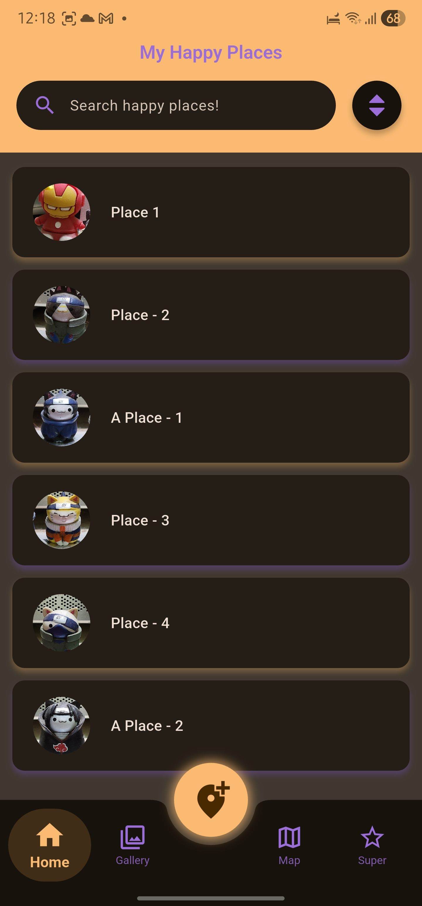
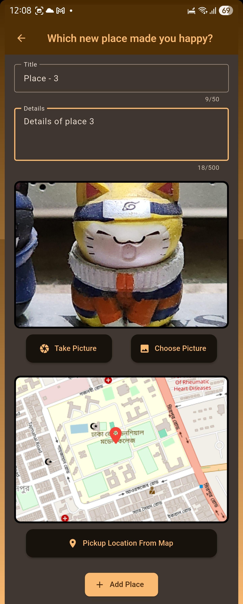
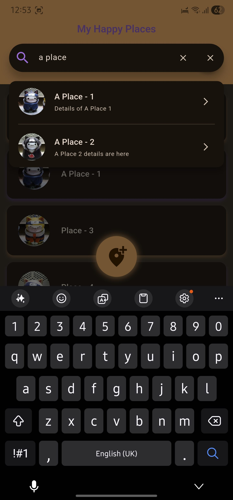
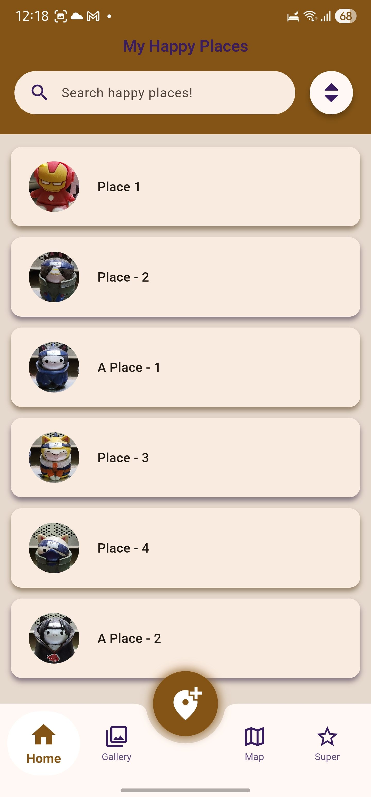
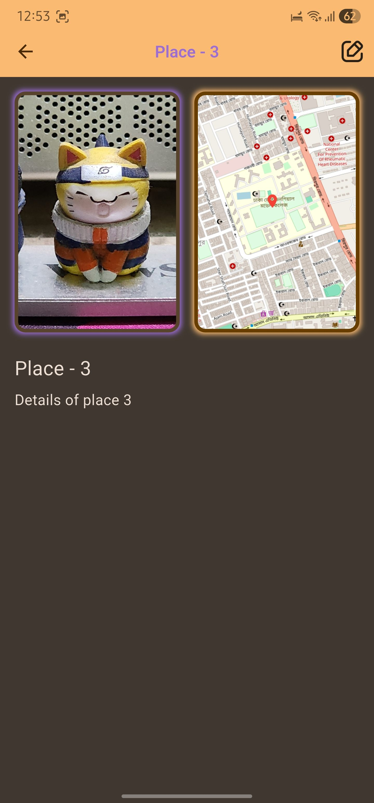
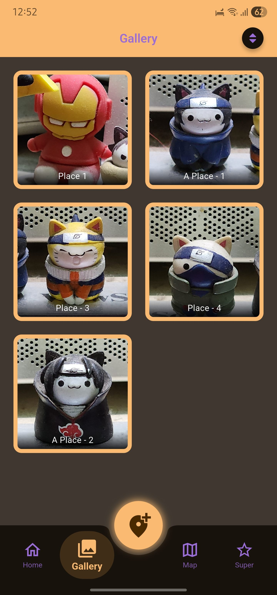
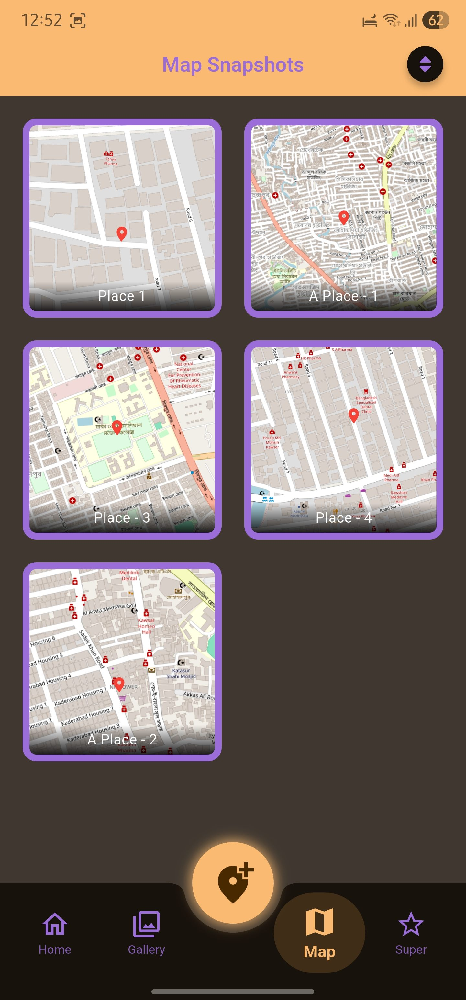

<h1 align="center">Flutter Happy Place</h1>

  Welcome to <strong>Flutter Happy Place</strong> — a Flutter app designed to help users 
  save and browse memorable places with a title, image, and map-based location selection.
  This updated version includes new features, enhanced UI, persistent storage, and visual
  previews through screenshots and a demo GIF.

<h2> Overview</h2>

  The application aims to let users store memorable places, including a picture taken on the spot
  and their snapshot of the map location. It offers a clean UI, simple workflows, and reliable storage.
  Moreover, all the custom widgets can be used as templates for other applications.

<h2> Key Features </h2>

<ul>
  <li><strong>Multi Theme</strong> — The app supports both light and dark theme according to the system settings</li>
  <li><strong>All Size Screen Responsiveness</strong> — It is built keeping all sizes of device in consideration.</li>
  <li><strong>Place List View</strong> — Displays all saved places with thumbnail image and title.</li>
  <li><strong>Add New Place</strong> — Add a title, upload/take a photo, and select a map location snapshot.</li>
  <li><strong>Interactive Map Picker</strong> — Choose a location using a fully Open State Map.</li>
  <li><strong>Place Detail Page</strong> — View large image, title, and mini-map with pin.</li>
  <li><strong>Edit Place</strong> — Update title, image, and selected location anytime.</li>
  <li><strong>Delete Place</strong> — Remove any saved place with confirmation dialog.</li>
  <li><strong>Persistent Local Storage</strong> — Places remain saved after app restart using SQLite (sqflite package).</li>
  <li><strong>Responsive Search Bar</strong> — Search Bar suggest related location with a black tined background while typing.</li>
  <li><strong>Sorting Option</strong> — Sorting of places can be done according to Newest, Oldest, Alphabetical, Rever Alphabetical. </li>
  <li><strong>Bottom Navigation Bar</strong> — Custom middle notched bottom navigation bar with a floating action button in the middle. </li>
  <li><strong>Improved UX</strong> — Validation for empty fields, error messages, smooth navigation.</li>
</ul>

<h2> Screenshots & Demo</h2>

Below are updated screenshots and a demo GIF showcasing the latest features:

<table>
<tr>
<td colspan="3" align="center"><h3>Dark Mode</h3></td>
<td align="center"><h3>Light Mode</h3></td>
<td align="center"><h3>Demo Of the Application</h3></td>
</tr>
<tr>
<td></td>
<td></td>
<td></td>
<td rowspan="2" valign="top"></td>
<td rowspan="2" valign="top"></td>
</tr>
<tr>
<td></td>
<td></td>
<td></td>
</tr>
</table>

<h2> Tech Stack</h2>

<ul>
  <li><code>Flutter</code> — UI Toolkit</li>
  <li><code>open_state_map</code> — Map implementation</li>
  <li><code>sqflite</code> — Local database</li>
  <li><code>image_picker</code> — Select or capture place image</li>
</ul>

<h2> Project Structure</h2>

<pre>
/lib
  ├── main.dart
  ├── screens/
  │     ├── place_list_screen.dart
  │     ├── add_place_screen.dart
  │     ├── place_detail_screen.dart
  │     ├── favorites_screen.dart
  │     ├── gallery_screen.dart
  │     ├── map_gallery_screen.dart
  │     ├── dashboard_screen.dart
  │     ├── edit_place_screen.dart
  │     └── splash_screen.dart
  ├── widgets/
  │     ├── custom_item_card.dart
  │     ├── custom_snackbar.dart
  │     ├── image_input.dart
  │     ├── location_input.dart
  │     ├── open_state_map.dart
  │     ├── places_list.dart
  │     ├── search_overlay.cart
  │     ├── searchbar.dart
  │     └── sort_button.dart
  ├── models/
  │     └── place.dart
  ├── data/
  │     └── app_theme.dart
  ├── providers/
  │     └── user_places.dart
  └── utils/
        └── file_utils.dart
</pre>

<h2> Installation & Setup</h2>

<ol>
  <li>Clone the repository:
    <pre><code>git clone https://github.com/Iftikhar-Shams-Niloy/flutter_happy_place.git
cd flutter_happy_place</code></pre>
  </li>

  <li>Install dependencies:
    <pre><code>flutter pub get</code></pre>
  </li>

  <li>Set up Google Maps (if using):
    <ul>
      <li>Add API key in <code>AndroidManifest.xml</code>, <code>Info.plist</code>, etc.</li>
      <li>Add location permissions.</li>
    </ul>
  </li>

  <li>Run the app:
    <pre><code>flutter run</code></pre>
  </li>
</ol>

<h2> Contributing </h2>

<ol>
  <li>Fork this repository.</li>
  <li>Create a feature branch:
    <pre><code>git checkout -b feature/new-feature</code></pre>
  </li>
  <li>Implement and test your changes.</li>
  <li>Commit and push:
    <pre><code>git add .
git commit -m "Add new feature"
git push origin feature/new-feature</code></pre>
  </li>
  <li>Open a Pull Request with description of your changes.</li>
</ol>

<h3 align = "center">Thank you for using <strong>Flutter Happy Place</strong>!</h3> 
  
Feel free to contribute or share feedback to help improve the project.

